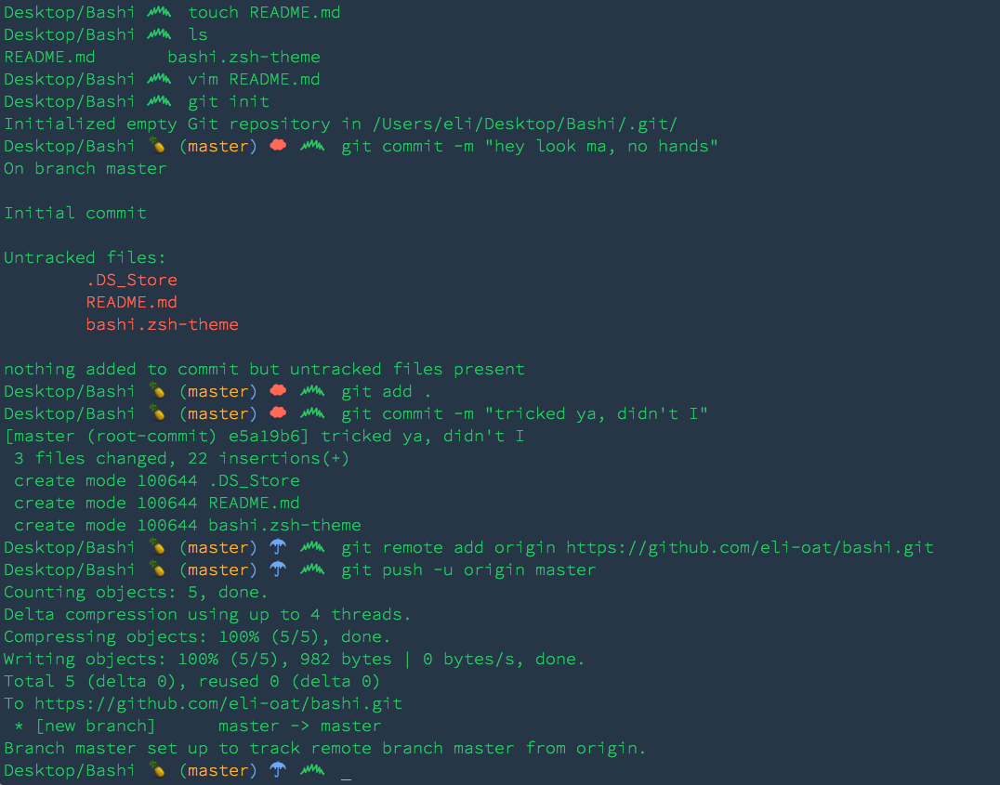
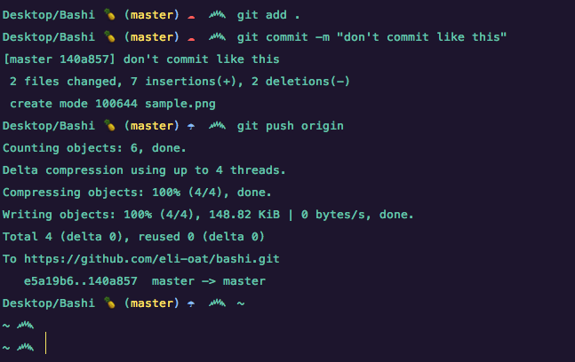

## Bashi
### A theme for ZSH.

I like to use it with Ahmet Sülek's [Flat UI Terminal
Theme](https://github.com/ahmetsulek/flat-terminal) or Pasquale D'Silva's [Saturn Terminal Theme](https://github.com/psql/saturn-colors).

Curious about the squiggly bit? It is a punctuation mark from the [Sinhala alphabet](https://en.wikipedia.org/wiki/Sinhala_alphabet) used by the Sinhala people in Sri Lanka.

The theme is named after my dog...also named Bashi.

### License
Do absolutely whatever you want with this theme, but please leave my dog out of it. 

[**MIT**](http://opensource.org/licenses/MIT)