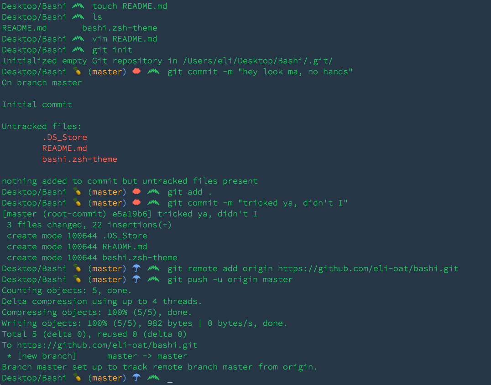

## Bashi
### A theme for ZSH.

I like to use it with Ahmet Sülek's [Flat UI Terminal
Theme](https://github.com/ahmetsulek/flat-terminal) or Pasquale D'Silva's [Saturn Terminal Theme](https://github.com/psql/saturn-colors).

